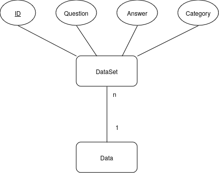

# GradingWithLLMs
## About the project
With this prototype, we aim to provide a student submission assessment solution that makes use of openAI's GPT4 model to efficiently grade free text answers provided in a .txt file. The main problem we are trying to solve is the tedious manual grading process, which tutors and professors have to go through when a large amount of student homework is submitted. 

## Functionality
In order to correctly evaluate the submissions, a prompt string is generated step by step on the server side, starting with the role description for the AI model (i.e. a tutor whose task is to grade the student answer to a certain question). The client provides the following data to the server:
*Mandatory*
- Question: you can only check a question at a time, meaning that all answers to the same question should be gathered in a single .txt file
- Student answers: as mentioned above, all answers should be (1) located in the same file and (2) separated by ### (three hashtags)
*Optional*
- Model answer: the user has the ability to provide a correct answer, which the GPT4 model compares the student answers to. If no model answer is given, GPT4 generates a solution of its own.
- Points: if no maximum points are chosen, the result is only categorized into *false*, *partially correct* or *correct*. Otherwise, the LLM grades the answer according to the maximum points, decreasing the amount when false information is provided or essential information is left out by the student.
- Word limit: it is possible to limit the amount of words an answer should contain. If not followed by the student, points will be lost depending on the exceding length.
- Keywords: the use of certain keywords may be crucial, thus the application allows the user to mention essential words that need to be found in the answer. If not present, the model marks their lack as an error, decreasing the amount of points.
After providing the information over the index.html, the data is processed. The progress can be seen at the bottom of the web page at any given time during processing. When finished, the user is notified and a results file (.txt) is downloaded automatically.

## Installation
### 1. (Optional but useful) Add a ssh key to the Repository. 
You can find instruction how to do this here: https://www.theserverside.com/blog/Coffee-Talk-Java-News-Stories-and-Opinions/GitHub-SSH-Windows-Example
### 2. Clone the repository

### 3. Create the python environment
For Windows instruction see: https://packaging.python.org/en/latest/guides/installing-using-pip-and-virtual-environments/#creating-a-virtual-environment
```bash
 python3 -m venv .venv
 source .venv/bin/activate
 #You can check if you are in the correct environment by typing: which python
 pip install -r requirements.txt
```
### 4. Create a .key file in the src/ directory
The .key file has to have the key in the first line, the url in the second line and the project name in the third line. You can use  the editor of your choice and just drag and drop it there
(Niklas sent us these in teams)
### 5. Start the application
```bash
cd src
python api_test.py
```
Congratulations you just used the gpt-4 API for the first time (Hooray!)

### 6. Play around
Now you can edit the api_test.py file or create your own one. Please use different branch if you do so you can name it like dev/yourNameofChoice

## Usage
In order to use the implemented pipeline, you need to clone the project

# Data


